# 国会山
正如人民大会堂可以预约参观一样，国会也可以。  
只不过...感觉国会的人气要差些，就算不预约直接到场也是可以参观的，没什么人排队。  

从华盛顿纪念碑顶部看过去的国会山  
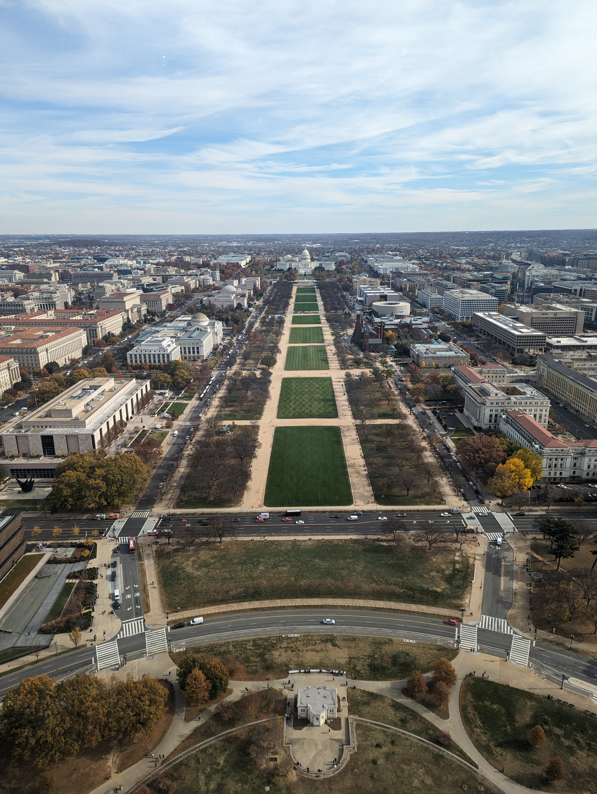

## 游客中心
很遗憾并不能自助参观，需要从游客中心开始跟着讲解员走。  
游客中心里就放着好些来自不同州的名人雕塑，但好像没有太明显的规律（不像接后面的部分）  

夏威夷的第一任国王  
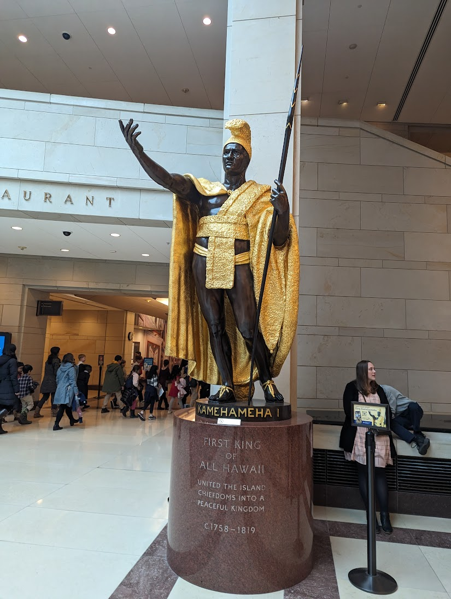

阿拉巴马的海伦凯勒
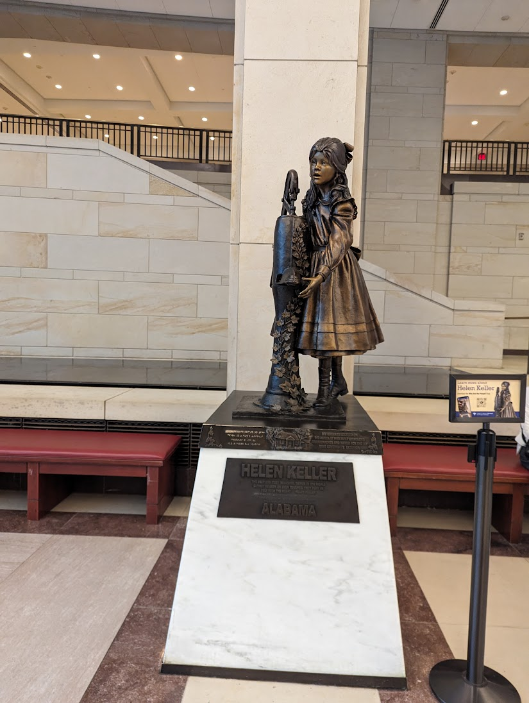

怀俄明的印第安酋长  
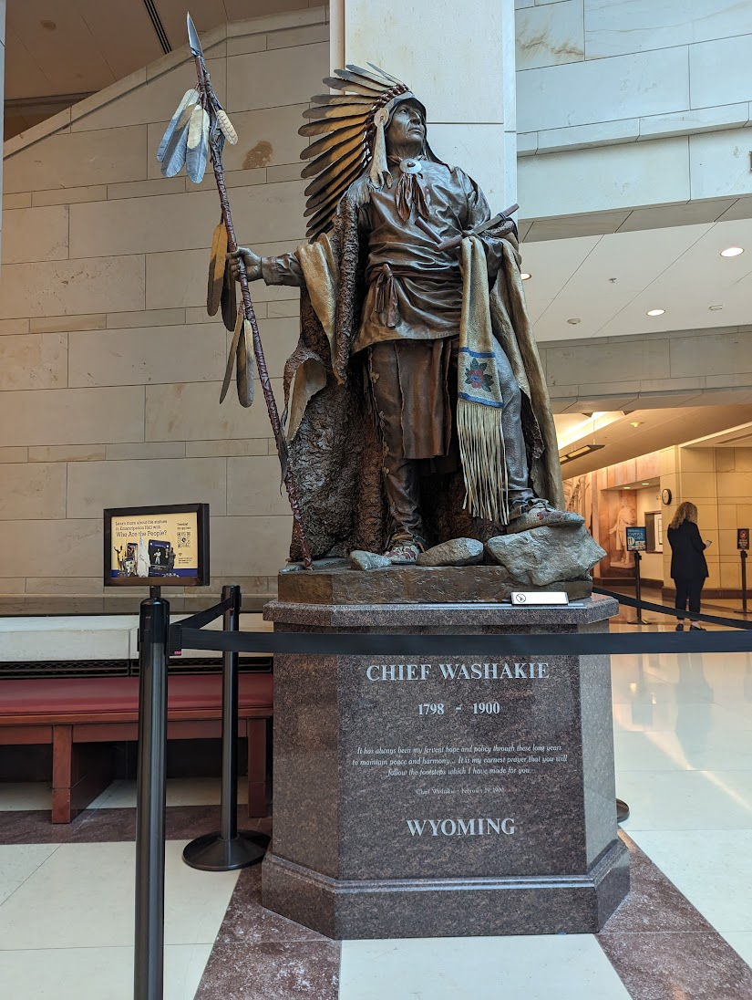

整个流程的第一步是看个十几分钟的（大内宣）影片，其中反复出现"Out of Many, One"这句话。  
其大意就是说各州联合起来，建立了这个统一的国家，"合众为一"。[维基百科](https://en.wikipedia.org/wiki/E_pluribus_unum)：  
> The meaning of the phrase originated from the concept that out of the union of the original 
> Thirteen Colonies emerged a new single nation. 
> It is emblazoned across the scroll and clenched in the eagle's beak on the Great Seal 
> of the United States.

## 墓穴
没错...第一站是在地下，称为墓穴（crypt）的部分。  

它被称为墓穴的原因，是因为本打算把华盛顿的遗体放在这里。可惜华盛顿的家属不同意，因此直到今天华盛顿也还是在他的弗农山庄家族墓地。  

这个墓穴里有13座雕像，代表建国时的13个州。  
后面才加入的州自然就没这个待遇啦...

忘了拍照，从谷歌上找来的图片。  
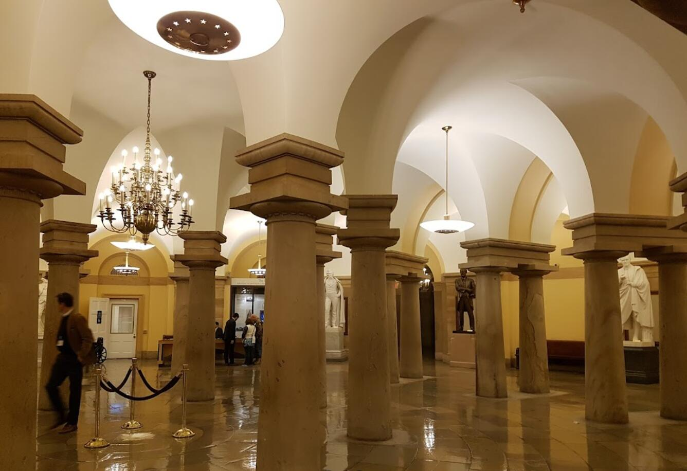

## 中央大厅
接下来一站，就是国会山上镜频率最高的中央大厅了。  
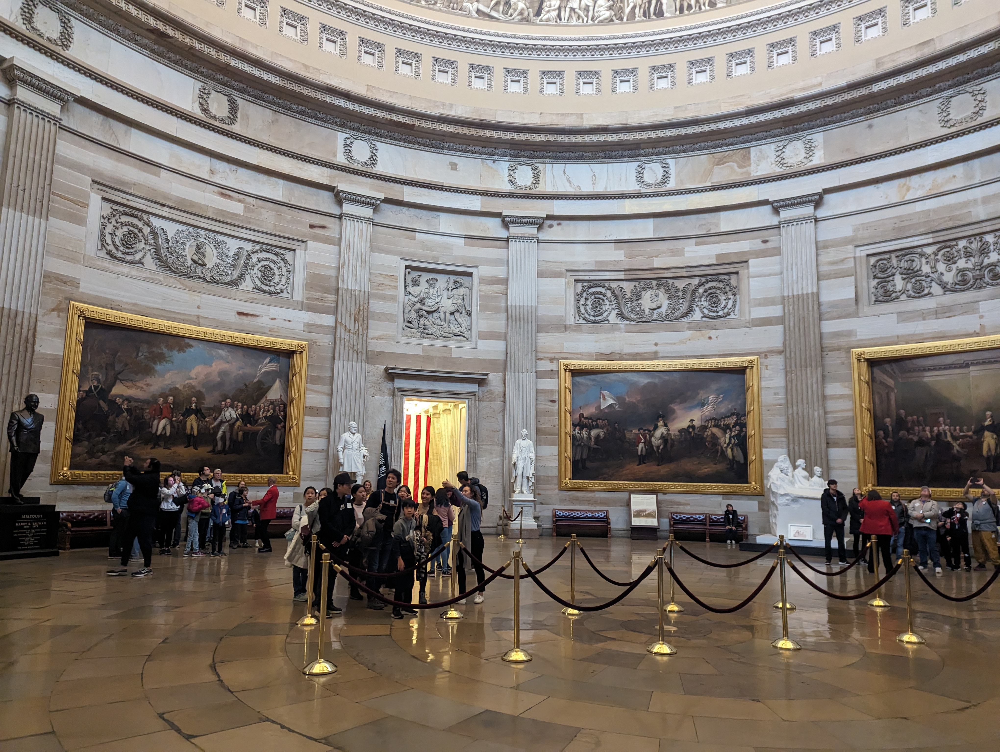

大厅中的一圈雕像，几乎都是知名的总统 - 华盛顿、林肯、里根、艾森豪威尔等等。  
但是其中有两个例外，一个是马丁路德金（上图最左侧的黑色雕像），一个是为妇女争取投票权的代表（上图最右侧的白色雕像）。

大厅中还有八幅画，都是在19世纪左右画成的：
- 独立宣言
  - 1776年发表的独立宣言和宣布建国
- 萨拉托加大捷
  - 大概算是美国独立战争中的一个转折点吧（我感觉主要还是美方总共就没打过几场胜仗）
- 约克镇大捷
  - 象征着独立战争结束的最后一战
- 华盛顿辞去大陆军总司令
  - 杯酒释（自己的）兵权，感觉是华盛顿人气的主要来源
- 哥伦布登陆
  - 1492年
- 发现密西西比河
- 宝嘉康蒂受洗
  - 宝嘉康蒂是早年弗吉尼亚州一个印第安酋长的女儿，她于1613年皈依基督教并受洗
- 朝圣者登船
  - 一批朝圣者（实际上就是被迫害的清教徒吧！）在荷兰登船前往英国南汉普顿。他们将在南汉普顿登上五月花号，前往美洲大陆

其中最有名的一幅，应该算是《独立宣言》了。讲解员说"我相信在场的每一位都在课本上看到过这幅画"，然而我就没看到过...  
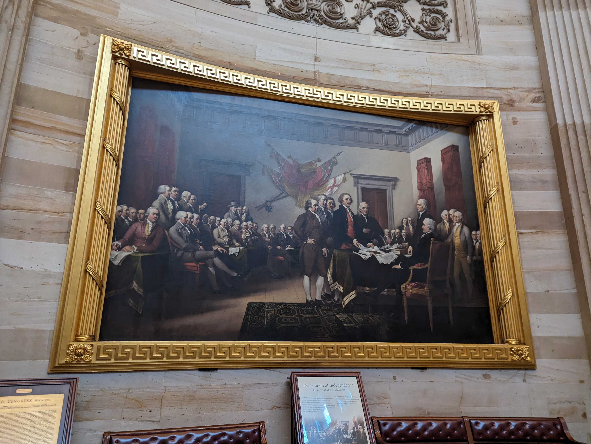

中央大厅的拱顶下也有一圈"浮雕"（实际上是平的，只不过做出了类似浮雕的视觉效果），同样在讲述美国的历史。  
只不过这些"浮雕"年代更新一些，差不多讲到了南北战争结束。  
整个拱顶差不多是从那一圈小方块往上开始，是一整个大铁盆倒扣在上面，只不过做成了类似石材的样子。  
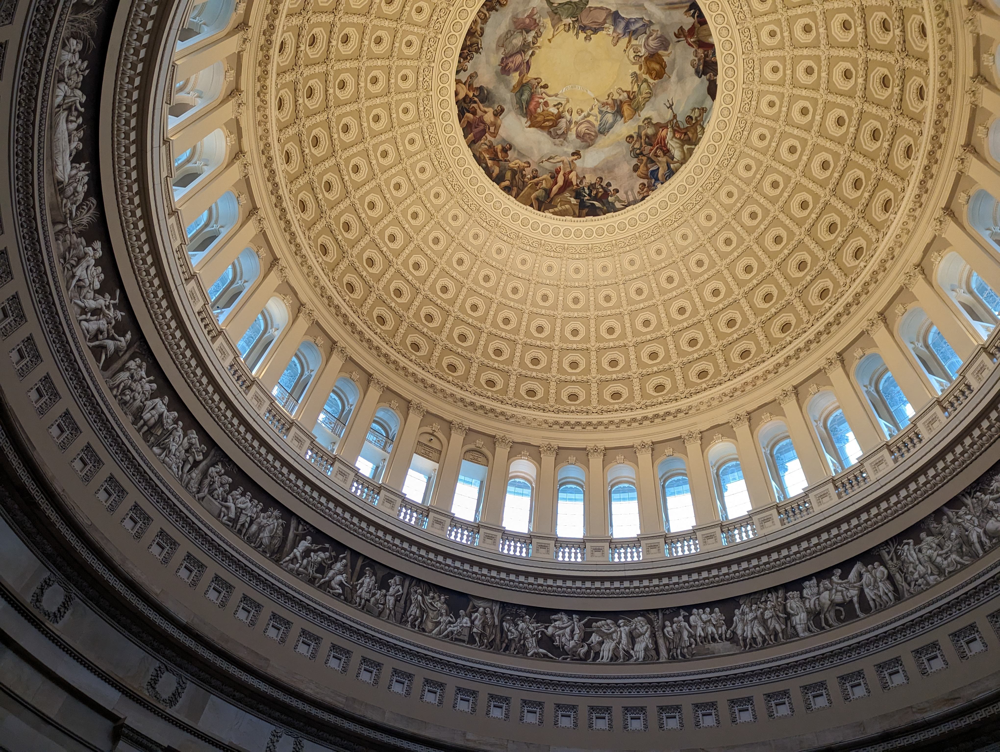

拱顶最上面的画是《华盛顿的神化》，顾名思义。  
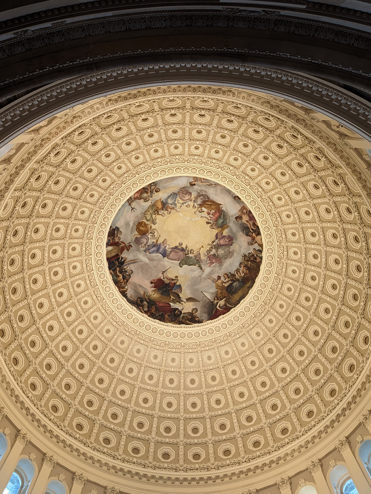

这幅画下面的盾牌，与美国队长最一开始的盾牌十分接近！  
  
这与[美国历史博物馆最后的那块美国队长盾牌](https://github.com/Handwarmer/note/blob/main/DC/AmericanHistoryMuseum/note.md#%E6%B5%81%E8%A1%8C%E6%96%87%E5%8C%96)，隐隐有些彼此呼应。  
果然这块盾牌是美国历史的暗线！（开玩笑的）

## 雕像厅
雕像厅曾经是众议院的会议厅，但因为它的拱顶会产生回音不方便开会（维基百科说的），众议院搬去了新的会议厅。  
现在这个地方的作用就是展出那些不适合放在墓穴和中央大厅，但又比较重要的雕像了。  

主要就是13个初创州之外，后续加入的35个州，每个州一座雕像。  
为什么不是50-13=37个州呢？似乎是缺了最晚加入的阿拉斯加和夏威夷。  
整个国会山里的全部雕像：https://www.aoc.gov/explore-capitol-campus/art/statuary-hall-collection-by-location

代表华盛顿州的Marcus Whitman（完全不认识）  
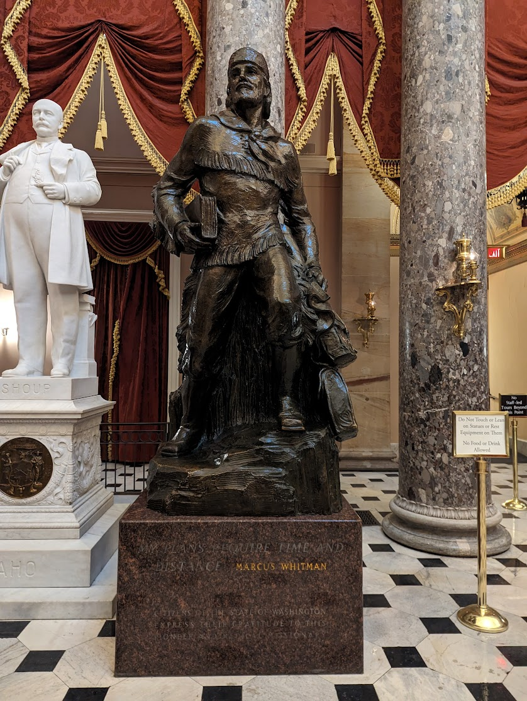  

整个雕像厅里唯一例外，不是为了代表某个州而存在的，汉密尔顿。  
这位也算是建国中举足轻重的人物，如果不是在决斗中丧生，当上总统应该是没问题的。  
可惜如今雕像却没法放在中央大厅。  
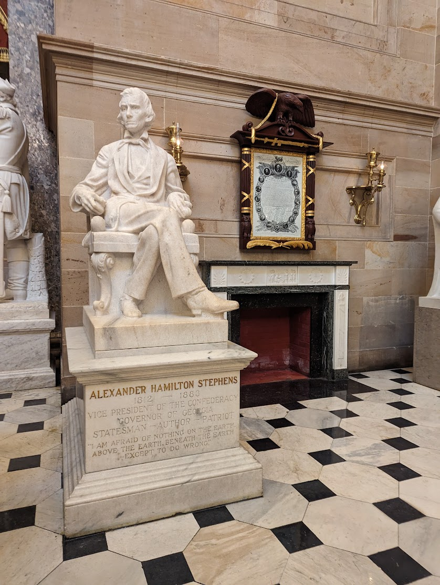 

## 参议院和众议院
整个跟着讲解员的参观过程就到此为止了，紧接着人群中就有人问：那我们可以去参议院或者众议院看他们开会吗？  
讲解员表示  
>可以，但是你需要对应的通行证，才能去参议院或者众议院。  
通行证需要联系自己所在地区对应的参/众议院议员，拿到的通行证可以用到议会换届为止。  
不过你看今天这下着雨，走去议员办公室要通行证也挺费劲的，可以试试给办公室打电话，让他们派个实习生给送过来  
毕竟嘛...他们是要巴结你要选票的！

不过这一番话对我们并不适用，外国旅客只需要拿护照到游客中心的柜台就可以拿到通行证。  
看到美国国会也这么区别对待，让我与之前"持外国护照能进，而中国护照不能进（没有身份证的情况下）"的南京博物院，也稍稍和解了一些。  

总之，游客中心只看了一眼我们的护照封皮，就爽快的给了通行证。  
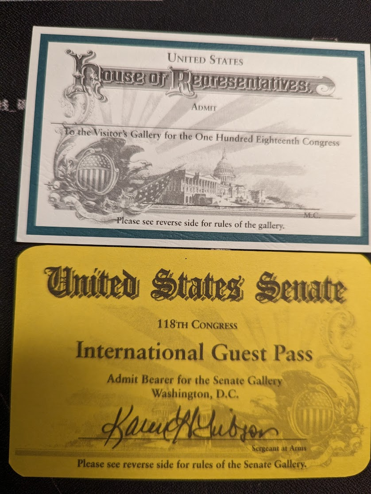 

进入两院参观要再过一遍安检，这次连电子设备都不能带进去，也就无从拍照了，只能找网上的照片替代一下。

两院会议厅中对平民开放的，只有一小部分，下图中最右侧两个扶手之间的那一二十个座位。可以看到图中就似乎有平民坐在那里。  
不知道当有关键议题讨论，大家都想来旁听的时候会怎样处理。  
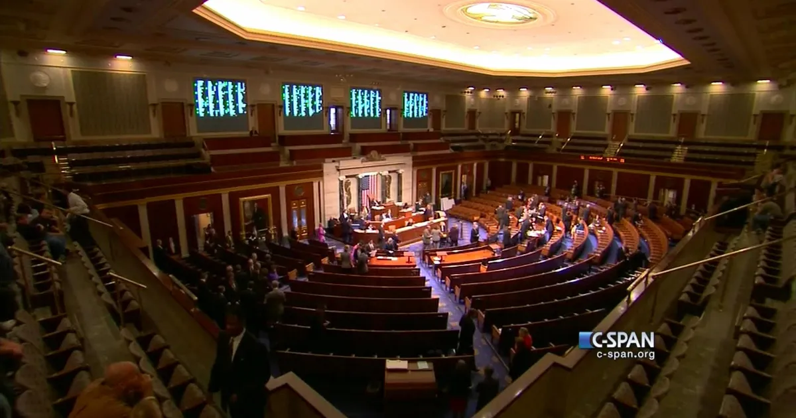

见到四五个游客和一个拿着工牌的妹子同行，全程妹子滔滔不绝的介绍。  
从话语中听来，她似乎就是那个"议员办公室来送通行证的实习生"，居然还顺带提供导游服务。  

在众议院坐着的时候，居然还真的要开会，可惜只是议长的代理出来念个一句话的通知"休会直到周五" （然后周五又通知休会到下周二...感觉一直在摸鱼）  
尽管如此...也是要走流程的，先来段祷告，再对国旗宣誓效忠。总共只有两分钟，其中大部分时间还是花在流程上。  
当时的录像和流程：https://live.house.gov/?date=2023-11-21

参议院看上去也差不多，只是座位少些，每个人都有了桌子。毕竟比起众议院的435人，参议院只有100人。